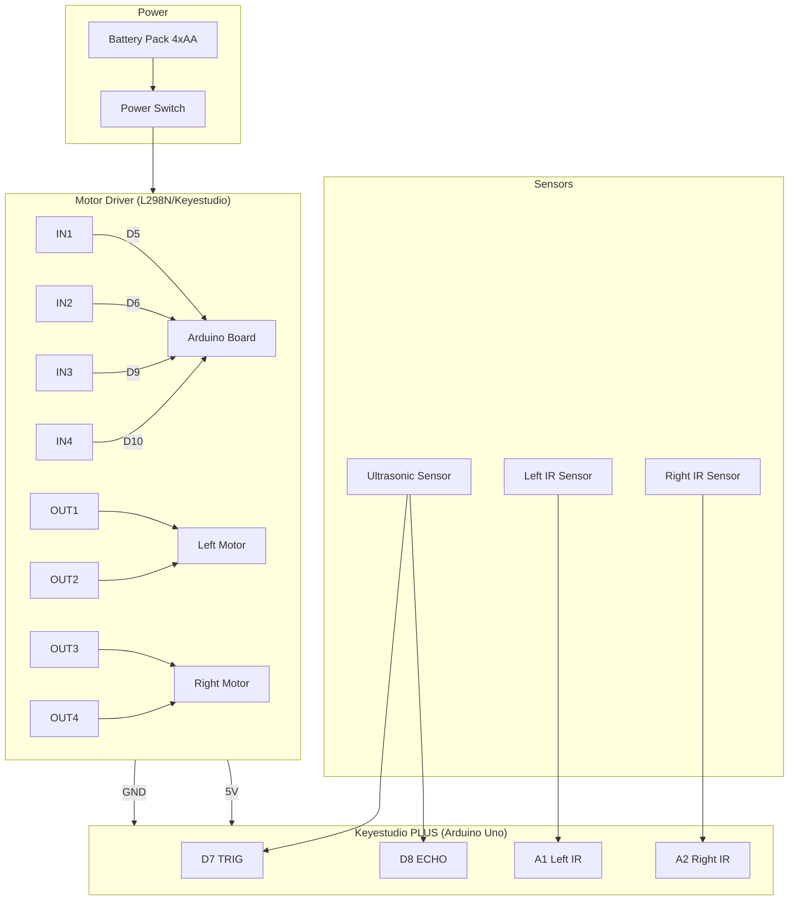
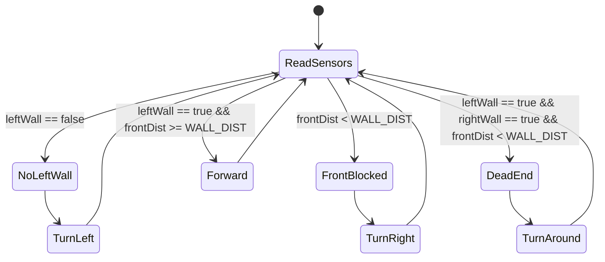
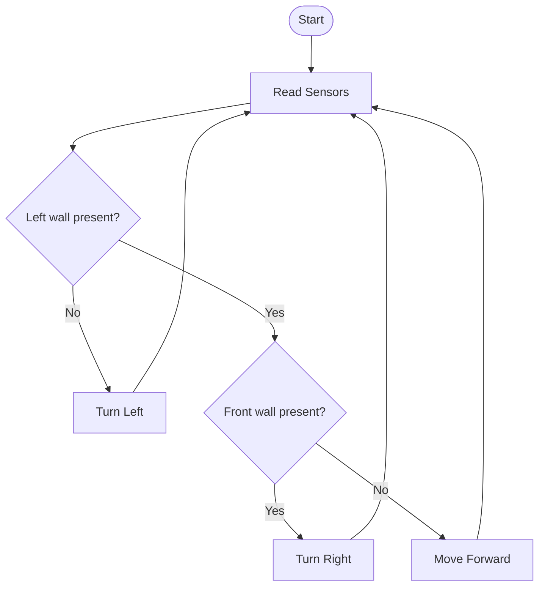

# Exemplar Student Work  
### Maze-Solving Robot — Year 10 Computing Technology  
### Sydney Technical High School  

This document provides exemplars demonstrating Band 6-level student work for moderation and teacher reference.

---

## 1. Exemplar Wiring Diagram (ASCII)



---

## 2. Exemplar State Machine Diagram (Left‑Hand Rule Logic)



## 3. Exemplar Flowchart



---

## 4. Exemplar Code Snippet (Band 6)

```cpp
if (!leftWallDetected()) {
    turnLeft();
} else if (getFrontDistance() < WALL_DIST) {
    turnRight();
} else {
    forward();
}
```

## 5. Exemplar Testing Logbook Entry

Date: Week 6

Test: Left turn detection

Result: Robot failed to turn left at junction.

Cause: IR sensor threshold too high.

Fix: Recalibrated threshold from 600 → 450.

Outcome: Robot now turns correctly.


---

## 6. Exemplar Reflection (Band 6)
The most challenging part was tuning the ultrasonic sensor. 

Early tests showed inconsistent readings due to incorrect mounting height. 

After adjusting the angle and adding a small foam stabiliser, readings became reliable. 

This improved the robot’s ability to detect front walls and reduced incorrect right turns.

---
